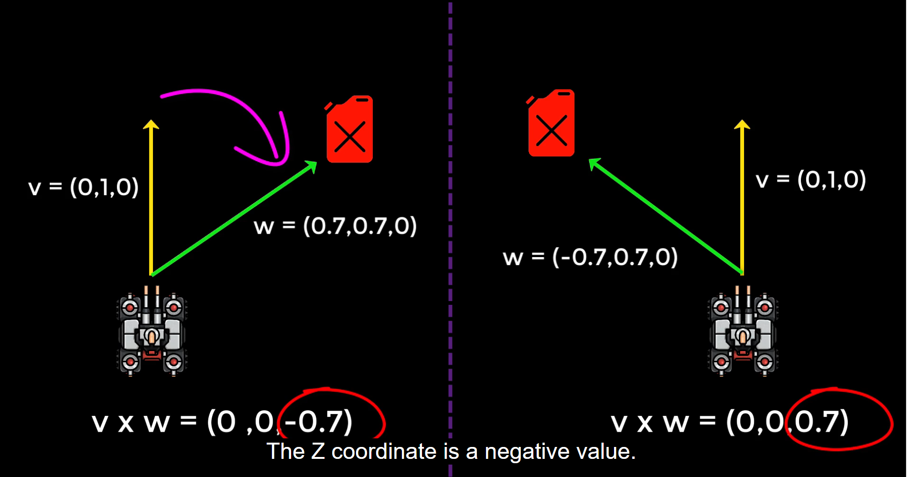

# Cross Product and Dot Product

## Cross Product

The **cross product**, denoted by **`×`**, is a binary operation on two vectors in three-dimensional space. The result is a vector that is perpendicular to both input vectors. The magnitude of the cross product is equal to the area of the parallelogram formed by the two vectors.

For two vectors **A = (A1, A2, A3)** and **B = (B1, B2, B3)**, the cross product **A × B** is given by:

## Dot Product

The **dot product**, denoted by **`·`**, is a scalar quantity resulting from the multiplication of two vectors. It measures the similarity in direction of two vectors and is the sum of the products of their corresponding components.

For two vectors **A = (A1, A2, A3)** and **B = (B1, B2, B3)**, the dot product **A · B** is given by:

