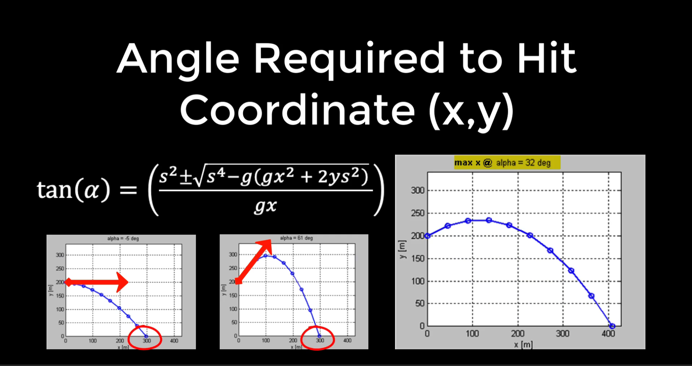

# Trajectory Formula

## Equations of Motion:

- Horizontal position at time \( t \): x(t) = V₀ * cos(α) * t
- Vertical position at time \( t \): y(t) = h + V₀ * sin(α) * t - 0.5 * g * t²

## Velocity Components:

- Horizontal velocity component (\( V_x \)): V₀ * cos(α)
- Vertical velocity component (\( V_y \)): V₀ * sin(α)

## Combined Formula:

- Trajectory formula: y = h + x * tan(α) - 0.5 * g * x² / (V₀² * cos²(α))

## Note:

- Horizontal position at time \( t \): \( x(t) \)
- Vertical position at time \( t \): \( y(t) \)
- Initial velocity of the projectile: \( V₀ \)
- Launch angle: \( α \)
- Gravitational acceleration (approximately 9.8 m/s²): \( g \)
- Initial height: \( h \)

